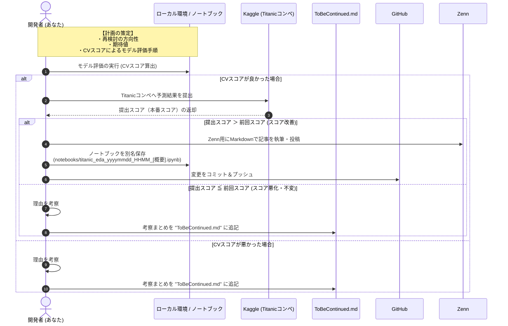
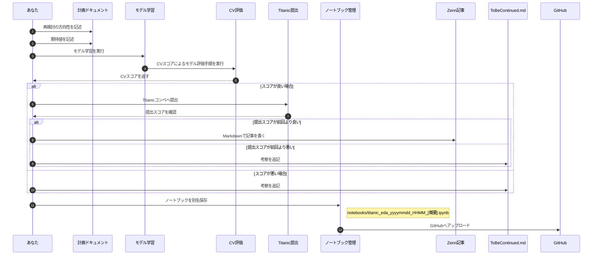
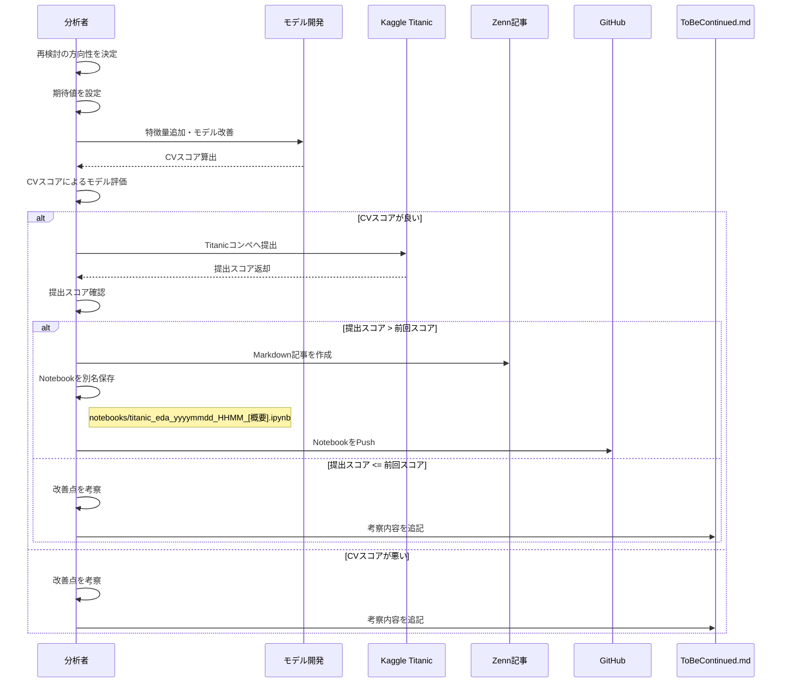

```mermaid
sequenceDiagram
    autonumber
    actor 開発者 as 開発者 (あなた)
    participant PC as ローカル環境 / ノートブック
    participant Kaggle as Kaggle (Titanicコンペ)
    participant MD as ToBeContinued.md
    participant Git as GitHub
    participant Zenn as Zenn

    Note over 開発者, PC: 【計画の策定】<br/>・再検討の方向性<br/>・期待値<br/>・CVスコアによるモデル評価手順

    開発者->>PC: モデル評価の実行 (CVスコア算出)
    
    alt CVスコアが良かった場合
        開発者->>Kaggle: Titanicコンペへ予測結果を提出
        Kaggle-->>開発者: 提出スコア（本番スコア）の返却
        
        alt 提出スコア ＞ 前回スコア (スコア改善)
            開発者->>Zenn: Zenn用にMarkdownで記事を執筆・投稿
            開発者->>PC: ノートブックを別名保存<br/>(notebooks/titanic_eda_yyyymmdd_HHMM_[概要].ipynb)
            開発者->>Git: 変更をコミット＆プッシュ
        else 提出スコア ≦ 前回スコア (スコア悪化・不変)
            開発者->>開発者: 理由を考察
            開発者->>MD: 考察まとめを "ToBeContinued.md" に追記
        end

    else CVスコアが悪かった場合
        開発者->>開発者: 理由を考察
        開発者->>MD: 考察まとめを "ToBeContinued.md" に追記
    end
```

```mermaid
sequenceDiagram
    autonumber
    participant User as あなた
    participant Plan as 計画ドキュメント
    participant Model as モデル学習
    participant Eval as CV評価
    participant Submit as Titanic提出
    participant Notebook as ノートブック管理
    participant Zenn as Zenn記事
    participant TBC as ToBeContinued.md

    User->>Plan: 再検討の方向性を記述
    User->>Plan: 期待値を記述

    User->>Model: モデル学習を実行
    Model->>Eval: CVスコアによるモデル評価手順を実行
    Eval-->>User: CVスコアを返す

    alt スコアが良い場合
        User->>Submit: Titanicコンペへ提出
        Submit-->>User: 提出スコアを確認

        alt 提出スコアが前回より良い
            User->>Zenn: Markdownで記事を書く
        else 提出スコアが前回より悪い
            User->>TBC: 考察を追記
        end

    else スコアが悪い場合
        User->>TBC: 考察を追記
    end

    User->>Notebook: ノートブックを別名保存  
    Note right of Notebook: notebooks/titanic_eda_yyyymmdd_HHMM_[概要].ipynb
    Notebook->>GitHub: GitHubへアップロード
```

```mermaid
sequenceDiagram
    participant Analyst as 分析者
    participant Model as モデル開発
    participant Kaggle as Kaggle Titanic
    participant Zenn as Zenn記事
    participant GitHub as GitHub
    participant Doc as ToBeContinued.md

    Analyst->>Analyst: 再検討の方向性を決定
    Analyst->>Analyst: 期待値を設定

    Analyst->>Model: 特徴量追加・モデル改善
    Model-->>Analyst: CVスコア算出

    Analyst->>Analyst: CVスコアによるモデル評価

    alt CVスコアが良い
        Analyst->>Kaggle: Titanicコンペへ提出
        Kaggle-->>Analyst: 提出スコア返却

        Analyst->>Analyst: 提出スコア確認

        alt 提出スコア > 前回スコア
            Analyst->>Zenn: Markdown記事を作成
            Analyst->>Analyst: Notebookを別名保存
            Note right of Analyst: notebooks/titanic_eda_yyyymmdd_HHMM_[概要].ipynb
            Analyst->>GitHub: NotebookをPush
        else 提出スコア <= 前回スコア
            Analyst->>Analyst: 改善点を考察
            Analyst->>Doc: 考察内容を追記
        end

    else CVスコアが悪い
        Analyst->>Analyst: 改善点を考察
        Analyst->>Doc: 考察内容を追記
    end
```
